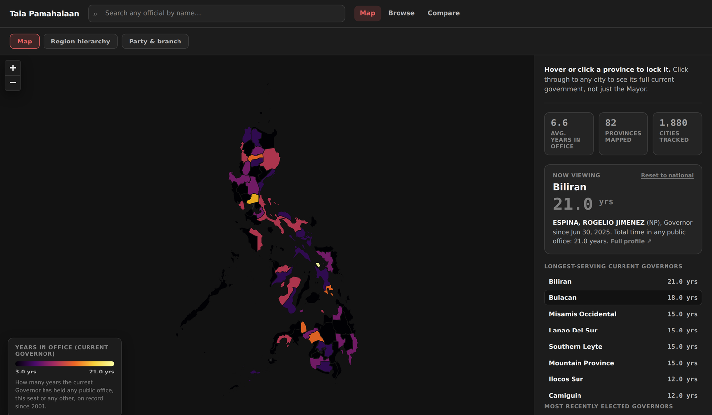

# Tala Pamahalaan

*Tala* is Filipino for record, and *pamahalaan* is government: a record of who currently holds office in the Philippines, and their full career, not just their current seat.



One governor here has held office 21 years running. Cebu alone has 56 cities, and one of them seats 86 councilors. That's the scale this app is built to make browsable rather than just technically knowable: a province is a click, a city is a click past that, and a whole branch of government is a tree you can page through in place instead of a spreadsheet you have to already know how to query.

## Run it

```
pip install pandas
python3 scripts/build_from_openhalalan.py   # raw CSV -> people.csv, offices.csv, terms.csv
python3 scripts/export_app_json.py          # those CSVs -> the JSON files app/ actually reads
cd app
python3 -m http.server
```

Open `http://localhost:8000`. Everything is static files; there's no database or build step.

## What's here

- **Map**: a choropleth of years-in-office by province, plus two hierarchy trees behind a view switch on the same page: one by region -> province -> city -> officeholders, one by branch -> party -> officeholders. Both render as a pannable, zoomable org chart that grows downward, with a plain indented list as an alternative (and the default on phones). Either way, a branch with 90-plus parties or a city with dozens of councilors pages in place, up and down arrows, rather than dumping every card onto the canvas at once or bouncing you out to Browse.
- **Browse**: every current official nationwide, one table, filterable by branch, position, province, party, and years in office.
- **Compare**: put two officials side by side, total years in office, and a real term-by-term timeline chart for each.
- **Person and city pages**: a permanent address for every official (`#/person/:id`) and every city government (`#/city/:province/:city`).

19,647 current officials, 88 provinces, 1,880 cities.

## How the data is fed

1. `data/raw/NLE_Winners_2004-2025.csv`, the raw source: every winning candidate, 2004-2025, one row per office per election.
2. `scripts/build_from_openhalalan.py` reads that CSV and writes three normalized tables: `people.csv` (one row per person, matched by name + province/city, since there's no government ID to match on), `offices.csv` (one row per office), `terms.csv` (one row per person-in-office-for-a-period).
3. `scripts/export_app_json.py` reads those three CSVs and writes the JSON files under `app/data/`: current officeholders by city/province, full term timelines by person, and a flat list of every current official. This is also where the region -> province groupings are added (hand-built, since the source file has no region column) and where a handful of known data gaps get logged rather than silently patched.
4. `app/app.js` fetches those JSON files on load and renders everything client-side. No server, no API calls after the initial load.

Party-list seats, appointed Executive positions, and the Judiciary aren't in the source file, so they aren't in the app. Vote counts and margins also aren't in the source (it only records who won), so neither is fabricated anywhere, including on the Compare chart, which uses real term dates instead.

## Later

`db/schema.sql` (Postgres, meant for Supabase) and `app/api.js` are an unused upgrade path for swapping the static JSON for a live, editable database without changing `app.js`'s page logic.
